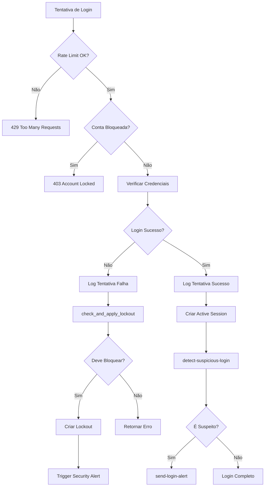

# SEMANA 2: Fortalecimento de Autenticação e Rate Limiting Avançado

## Visão Geral

A Semana 2 foca em **fortalecer a camada de autenticação** e **implementar rate limiting robusto em produção**. Esta implementação substitui o sistema em memória por soluções persistentes usando o banco de dados Supabase.

## Status: ✅ COMPLETO

---

## Componentes Implementados

### 1. Rate Limiting em Produção

#### Tabela: `rate_limit_entries`
Armazena todas as entradas de rate limiting de forma persistente.

**Campos:**
- `id`: UUID único
- `identifier`: IP ou user_id
- `endpoint`: Caminho do endpoint
- `request_count`: Contador de requisições
- `window_start` / `window_end`: Janela de tempo
- `blocked_until`: Timestamp de bloqueio (se excedido)

**Função SQL: `check_rate_limit_v2`**
```sql
check_rate_limit_v2(
  p_identifier text,
  p_endpoint text,
  p_max_requests integer,
  p_window_seconds integer
) RETURNS jsonb
```

**Retorno:**
```json
{
  "allowed": boolean,
  "remaining": number,
  "reset_at": timestamp,
  "reason": string (opcional),
  "blocked_until": timestamp (opcional)
}
```

**Lógica:**
- Busca entrada ativa para o identificador + endpoint
- Se bloqueado, retorna negado
- Se não existe ou expirou, cria nova entrada
- Incrementa contador e verifica limite
- Se excedido, bloqueia por tempo adicional (2x window)

#### Edge Function Atualizada: `rate-limiter`

**Configuração:**
```typescript
const RATE_LIMITS = {
  '/auth/login': { max: 10, windowSeconds: 60 },
  '/auth/signup': { max: 5, windowSeconds: 60 },
  '/api/*': { max: 60, windowSeconds: 60 },
  '/upload/*': { max: 5, windowSeconds: 60 },
  'default': { max: 100, windowSeconds: 60 }
};
```

**Mudanças:**
- ❌ Removido: `Map` em memória
- ✅ Adicionado: Chamadas à função `check_rate_limit_v2`
- ✅ Adicionado: Headers padrão HTTP: `X-RateLimit-*`, `Retry-After`
- ✅ Adicionado: Log de violações na tabela `security_events`

**Headers de Resposta:**
```
X-RateLimit-Limit: 10
X-RateLimit-Remaining: 7
X-RateLimit-Reset: 2025-10-09T18:30:00Z
Retry-After: 60 (se bloqueado)
```

---

### 2. Proteção Avançada Contra Brute Force

#### Tabela: `login_attempts`
Registra **todas** as tentativas de login (sucesso e falha).

**Campos:**
- `identifier`: Email, IP ou fingerprint
- `attempt_type`: login, mfa, password_reset
- `success`: boolean
- `failure_reason`: Motivo da falha
- `ip_address`, `user_agent`, `metadata`

**Índices:**
- `idx_login_attempts_identifier`
- `idx_login_attempts_created_at`
- `idx_login_attempts_ip`
- `idx_login_attempts_success` (composto)

#### Tabela: `account_lockouts`
Gerencia bloqueios de conta.

**Campos:**
- `identifier`: Email ou IP bloqueado
- `lockout_type`: temporary, extended, permanent
- `locked_at`, `locked_until`
- `reason`, `failed_attempts`
- `unlocked_at`, `unlocked_by`

**Tipos de Bloqueio:**
- **Temporary** (1 hora): 5-9 tentativas falhas em 30 minutos
- **Extended** (24 horas): 10+ tentativas falhas em 30 minutos
- **Permanent**: Requer desbloqueio manual

#### Função SQL: `check_and_apply_lockout`

**Lógica:**
1. Verifica se já está bloqueado
2. Conta falhas recentes (últimos 30 minutos)
3. Aplica bloqueio progressivo
4. Dispara alerta de segurança via `trigger_security_alert`

**Integração:**
- Chamada automaticamente por `log_login_attempt`
- Dispara alerta de segurança com severidade baseada no tipo

#### Função SQL: `log_login_attempt`

```sql
log_login_attempt(
  p_identifier text,
  p_attempt_type text,
  p_success boolean,
  p_failure_reason text DEFAULT NULL,
  p_ip_address inet DEFAULT NULL,
  p_user_agent text DEFAULT NULL,
  p_metadata jsonb DEFAULT NULL
) RETURNS uuid
```

**Uso:**
```typescript
await supabase.rpc('log_login_attempt', {
  p_identifier: email,
  p_attempt_type: 'login',
  p_success: false,
  p_failure_reason: 'invalid_credentials',
  p_ip_address: clientIp,
  p_user_agent: userAgent
});
```

---

### 3. Gestão de Sessões JWT

#### Tabela: `active_sessions`
Rastreia todas as sessões ativas de usuários.

**Campos:**
- `user_id`: Referência ao auth.users
- `session_token`: Token único da sessão
- `refresh_token_hash`: Hash do refresh token
- `ip_address`, `user_agent`, `device_fingerprint`
- `last_activity`, `expires_at`
- `revoked_at`, `revoke_reason`

**Índices:**
- `idx_active_sessions_user_id`
- `idx_active_sessions_token` (UNIQUE)
- `idx_active_sessions_expires`
- `idx_active_sessions_active` (WHERE revoked_at IS NULL)

#### Função SQL: `validate_session`

**Lógica:**
1. Busca sessão por token
2. Verifica se não foi revogada
3. Verifica se não expirou
4. Atualiza `last_activity`
5. Retorna status de validação

**Retorno:**
```json
{
  "valid": true,
  "user_id": "uuid",
  "expires_at": "timestamp",
  "last_activity": "timestamp"
}
```

#### Função SQL: `revoke_user_sessions`

```sql
revoke_user_sessions(
  p_user_id uuid,
  p_reason text DEFAULT 'user_initiated',
  p_keep_current boolean DEFAULT false,
  p_current_session_token text DEFAULT NULL
) RETURNS integer
```

**Casos de Uso:**
1. **Logout de todas as sessões**: `p_keep_current = false`
2. **Logout de outras sessões**: `p_keep_current = true`
3. **Revogação por suspeita**: `p_reason = 'suspicious_activity'`

**Eventos Disparados:**
- Log de segurança: `sessions_revoked`
- Retorna número de sessões revogadas

---

### 4. Notificações de Login Suspeito

#### Tabela: `login_notifications`
Armazena notificações enviadas aos usuários.

**Campos:**
- `user_id`: Usuário notificado
- `notification_type`: new_device, new_location, unusual_time
- `login_attempt_id`: Referência à tentativa
- `sent_at`, `acknowledged_at`
- `metadata`: Detalhes do login suspeito

#### Edge Function: `detect-suspicious-login`

**Fatores de Suspeita:**
1. **Novo dispositivo**: User-Agent não reconhecido
2. **Novo IP**: IP não presente em logins anteriores
3. **Horário incomum**: Entre 2h e 6h da manhã

**Lógica:**
```typescript
1. Buscar últimos 10 logins bem-sucedidos
2. Comparar IP e User-Agent
3. Verificar horário atual
4. Se suspeito:
   - Criar registro em login_notifications
   - Chamar send-login-alert
   - Retornar fatores suspeitos
```

#### Edge Function: `send-login-alert`

**Email Template:**
```html
🔐 [Tipo de Alerta]
- Data/Hora: [timestamp]
- IP: [ip_address]
- Dispositivo: [user_agent]

[Botão] ⚠️ Não fui eu - Revogar Sessões
```

**Botão de Ação:**
- Link direto para `revoke_user_sessions`
- Revoga todas as sessões do usuário
- Dispara alerta de segurança de alta prioridade

**Integração:**
- Usa Resend para envio de email
- Gera token único para revogação
- Registra evento de segurança

---

### 5. Dashboard de Segurança - Componentes React

#### Componente: `AuthSecurityMonitor.tsx`

**Funcionalidades:**
- Exibe tentativas de login recentes (10 últimas)
- Lista bloqueios ativos de conta
- Ícones visuais para sucesso/falha
- Badges para tipos de bloqueio

**Dados Exibidos:**
```typescript
- Tentativas: identifier, tipo, sucesso, razão, timestamp
- Bloqueios: identifier, tipo, motivo, até quando, tentativas
```

#### Componente: `ActiveSessionsTable.tsx`

**Funcionalidades:**
- Lista todas as sessões ativas do usuário
- Identifica tipo de dispositivo (Mobile/Tablet/Desktop)
- Mostra IP, última atividade, expiração
- Botão para revogar sessão individual
- Botão para revogar todas as sessões (exceto atual)

**Ações:**
- `revokeSession(sessionId)`: Revoga sessão específica
- `revokeAllSessions()`: Revoga todas exceto atual

---

## Arquitetura de Segurança

### Fluxo de Login com Proteção



### Bloqueio Progressivo

| Tentativas Falhas (30 min) | Tipo de Bloqueio | Duração | Ação |
|----------------------------|------------------|---------|------|
| 1-4 | Nenhum | - | Log apenas |
| 5-9 | Temporary | 1 hora | Alerta Medium |
| 10+ | Extended | 24 horas | Alerta High |
| Manual | Permanent | Indefinido | Desbloqueio manual |

---

## Integração com AuthContext

### Mudanças Necessárias

```typescript
// Antes do login
const lockoutCheck = await supabase.rpc('check_and_apply_lockout', {
  p_identifier: email,
  p_attempt_type: 'login'
});

if (lockoutCheck.data?.locked) {
  throw new Error(`Account locked: ${lockoutCheck.data.reason}`);
}

// Após tentativa (sucesso ou falha)
await supabase.rpc('log_login_attempt', {
  p_identifier: email,
  p_attempt_type: 'login',
  p_success: loginSuccess,
  p_failure_reason: loginSuccess ? null : errorReason,
  p_ip_address: clientIp,
  p_user_agent: navigator.userAgent
});

// Se sucesso, criar sessão
if (loginSuccess) {
  const { data: session } = await supabase.auth.getSession();
  
  await supabase.from('active_sessions').insert({
    user_id: user.id,
    session_token: session.access_token,
    refresh_token_hash: hashToken(session.refresh_token),
    ip_address: clientIp,
    user_agent: navigator.userAgent,
    expires_at: new Date(Date.now() + 3600000) // 1 hora
  });

  // Detectar login suspeito
  await supabase.functions.invoke('detect-suspicious-login', {
    body: {
      user_id: user.id,
      login_attempt_id: attemptId,
      ip_address: clientIp,
      user_agent: navigator.userAgent
    }
  });
}
```

---

## RLS Policies

### `rate_limit_entries`
```sql
-- Apenas owners podem visualizar
CREATE POLICY "Owners can manage rate limit entries"
  ON rate_limit_entries FOR ALL
  USING (get_user_role(auth.uid()) = 'owner');
```

### `login_attempts`
```sql
-- Usuários veem apenas suas tentativas
CREATE POLICY "Users can view own login attempts"
  ON login_attempts FOR SELECT
  USING (
    identifier = get_user_email(auth.uid()) OR
    get_user_role(auth.uid()) = 'owner'
  );

-- Sistema pode inserir
CREATE POLICY "System can insert login attempts"
  ON login_attempts FOR INSERT
  WITH CHECK (true);
```

### `account_lockouts`
```sql
-- Usuários veem apenas seus bloqueios
CREATE POLICY "Users can view own lockouts"
  ON account_lockouts FOR SELECT
  USING (
    user_id = auth.uid() OR
    get_user_role(auth.uid()) = 'owner'
  );

-- Owners podem gerenciar
CREATE POLICY "Owners can manage lockouts"
  ON account_lockouts FOR ALL
  USING (get_user_role(auth.uid()) = 'owner');
```

### `active_sessions`
```sql
-- Usuários gerenciam apenas suas sessões
CREATE POLICY "Users can view own sessions"
  ON active_sessions FOR SELECT
  USING (user_id = auth.uid());

CREATE POLICY "Users can manage own sessions"
  ON active_sessions FOR ALL
  USING (user_id = auth.uid());

-- Owners veem todas
CREATE POLICY "Owners can view all sessions"
  ON active_sessions FOR SELECT
  USING (get_user_role(auth.uid()) = 'owner');
```

### `login_notifications`
```sql
-- Usuários veem apenas suas notificações
CREATE POLICY "Users can view own notifications"
  ON login_notifications FOR SELECT
  USING (user_id = auth.uid());

-- Sistema pode inserir
CREATE POLICY "System can insert notifications"
  ON login_notifications FOR INSERT
  WITH CHECK (true);

-- Usuários podem atualizar (acknowledged_at)
CREATE POLICY "Users can update own notifications"
  ON login_notifications FOR UPDATE
  USING (user_id = auth.uid());
```

---

## Performance e Otimização

### Índices Criados
```sql
-- Rate Limiting
idx_rate_limit_identifier_endpoint (identifier, endpoint)
idx_rate_limit_window_end (window_end)
idx_rate_limit_blocked (blocked_until)

-- Login Attempts
idx_login_attempts_identifier (identifier)
idx_login_attempts_created_at (created_at)
idx_login_attempts_ip (ip_address)
idx_login_attempts_success (success, created_at)

-- Account Lockouts
idx_account_lockouts_user_id (user_id)
idx_account_lockouts_identifier (identifier)
idx_account_lockouts_locked_until (locked_until)
idx_account_lockouts_active (unlocked_at) WHERE unlocked_at IS NULL

-- Active Sessions
idx_active_sessions_user_id (user_id)
idx_active_sessions_token (session_token) UNIQUE
idx_active_sessions_expires (expires_at)
idx_active_sessions_active (revoked_at) WHERE revoked_at IS NULL
```

### Limpeza Automática

**Função: `cleanup_rate_limit_entries`**
```sql
-- Executar diariamente via cron job
DELETE FROM rate_limit_entries
WHERE window_end < (now() - interval '1 hour')
  AND (blocked_until IS NULL OR blocked_until < now());
```

**Sugestão de Cron:**
```sql
-- Adicionar ao pg_cron
SELECT cron.schedule(
  'cleanup-rate-limits',
  '0 */6 * * *', -- A cada 6 horas
  'SELECT public.cleanup_rate_limit_entries()'
);
```

---

## Testes e Validação

### Testes de Rate Limiting
```bash
# Testar limite de login (10/min)
for i in {1..15}; do
  curl -X POST https://[projeto].supabase.co/functions/v1/rate-limiter \
    -H "Content-Type: application/json" \
    -d '{"path": "/auth/login"}'
done

# Esperado: 10 sucesso (200), 5 bloqueio (429)
```

### Testes de Brute Force
```sql
-- Simular 5 tentativas falhas
DO $$
BEGIN
  FOR i IN 1..5 LOOP
    PERFORM public.log_login_attempt(
      'test@example.com',
      'login',
      false,
      'invalid_credentials',
      '192.168.1.1'::inet,
      'Test Agent'
    );
  END LOOP;
END $$;

-- Verificar lockout
SELECT * FROM account_lockouts 
WHERE identifier = 'test@example.com';

-- Esperado: lockout_type = 'temporary', locked_until = now() + 1 hour
```

### Testes de Sessões
```sql
-- Criar sessão de teste
INSERT INTO active_sessions (
  user_id, session_token, expires_at
) VALUES (
  auth.uid(),
  'test-token-123',
  now() + interval '1 hour'
);

-- Validar sessão
SELECT public.validate_session('test-token-123');
-- Esperado: {"valid": true, "user_id": "...", ...}

-- Revogar sessão
SELECT public.revoke_user_sessions(
  auth.uid(),
  'test',
  false,
  NULL
);
-- Esperado: 1 (número de sessões revogadas)
```

---

## Troubleshooting

### Problema: Rate limit não funciona
**Solução:**
1. Verificar se Edge Function está usando `check_rate_limit_v2`
2. Verificar logs: `SELECT * FROM rate_limit_entries`
3. Verificar se limpeza automática está rodando

### Problema: Bloqueio não ativa
**Solução:**
1. Verificar contagem: `SELECT COUNT(*) FROM login_attempts WHERE identifier = '...' AND success = false`
2. Verificar janela de tempo (30 minutos)
3. Verificar se função `check_and_apply_lockout` está sendo chamada

### Problema: Notificações não são enviadas
**Solução:**
1. Verificar se `RESEND_API_KEY` está configurado
2. Verificar logs da Edge Function: `send-login-alert`
3. Verificar tabela: `SELECT * FROM login_notifications`

---

## Próximos Passos

### Melhorias Futuras (Semana 3+)
- [ ] Integração com GeoIP para localização precisa
- [ ] Machine Learning para detecção de padrões suspeitos
- [ ] Dashboard avançado com gráficos históricos
- [ ] Suporte a WebAuthn/FIDO2
- [ ] Sistema de "trusted devices"
- [ ] Notificações push via Firebase
- [ ] Análise de risco baseada em comportamento

### Monitoramento
- [ ] Configurar alertas para bloqueios excessivos
- [ ] Monitorar performance de queries (>100ms)
- [ ] Dashboard de métricas de segurança
- [ ] Relatórios semanais de tentativas de ataque

---

## Configuração do Projeto

### Edge Functions
Adicionar ao `supabase/config.toml`:
```toml
[functions.detect-suspicious-login]
verify_jwt = false

[functions.send-login-alert]
verify_jwt = false
```

### Secrets Necessários
```bash
RESEND_API_KEY=re_... # Para envio de emails
SUPABASE_URL=https://...
SUPABASE_SERVICE_ROLE_KEY=...
```

---

## Benefícios da Implementação

✅ **Rate limiting robusto** que funciona em ambientes distribuídos  
✅ **Proteção avançada contra brute force** com bloqueio progressivo  
✅ **Gestão completa de sessões** com revogação granular  
✅ **Auditoria detalhada** de todas as tentativas de autenticação  
✅ **Notificações proativas** de atividade suspeita  
✅ **Dashboard expandido** para monitoramento em tempo real  
✅ **Conformidade** com melhores práticas de segurança (OWASP)  
✅ **Escalabilidade** horizontal sem perder estado  

---

## Contato e Suporte

Para dúvidas ou problemas, consulte:
- [Documentação Supabase - Auth](https://supabase.com/docs/guides/auth)
- [Documentação Supabase - RLS](https://supabase.com/docs/guides/auth/row-level-security)
- [OWASP Authentication Cheat Sheet](https://cheatsheetseries.owasp.org/cheatsheets/Authentication_Cheat_Sheet.html)
